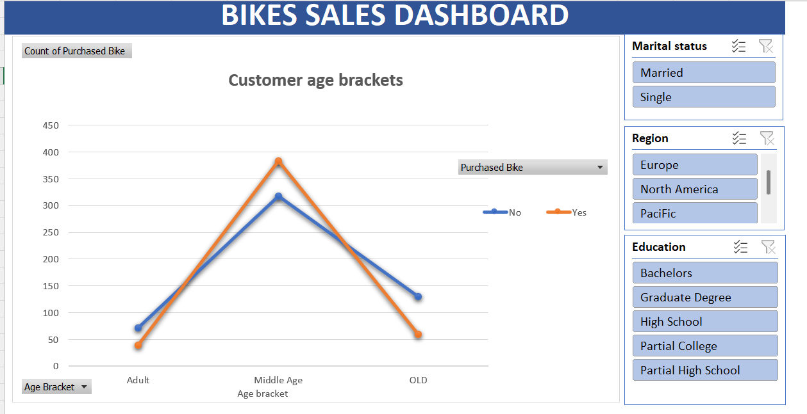
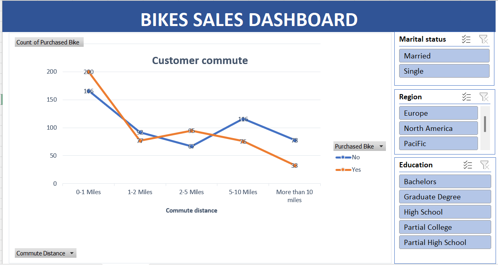
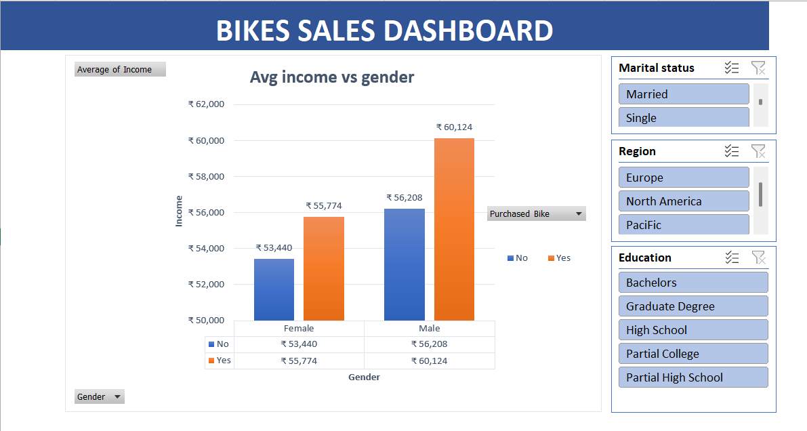

# Bikes Sales Analysis- Dashboard(Excel)
**Project Overview**
This project analyzes bike sales data using Microsoft Excel to understand customer purchasing behavior and sales performance patterns.
The goal of this project was to review bike sales performance and identify key factors influencing customer purchase decisions such as age, commute distance, income level, gender, region, education, and marital status.
An interactive dashboard was created using Pivot Tables, Charts, and Slicers to allow dynamic filtering and analysis.

**Tools & Excel Features Used**
-Microsoft Excel
-Pivot Tables
-Pivot Charts
-Slicers (Interactive Filters)
-IF Function
-Find & Replace
-Data Cleaning & Formatting
-Dashboard Alignment & Design
-Chart Customization

**Dashboard Preview**
🔹 **Customer Age Bracket Analysis**

-Analyzed purchase trends across Adult, Middle Age, and Old age groups
-Identified Middle Age customers as the highest purchasing segment
-Compared Purchased vs Non-Purchased customers

🔹**Customer Commute Distance Analysis**

-Examined impact of commute distance on bike purchases
-Customers commuting shorter distances showed higher purchase interest
-Interactive slicers allow filtering by region, education, and marital status

🔹**Average Income vs Gender Analysis**

-Compared average income of male and female customers
-Analyzed purchasing behavior based on income levels
-Higher income groups showed stronger purchase probability

**Key Insights**
-Middle-aged customers are the primary buyers.
-Short commute distance customers show higher likelihood of purchasing bikes.
-Higher income levels correlate with higher purchase rates.
-Purchase trends vary based on region and education level.
-Interactive filtering improves decision-making analysis.

 **Data Preparation Process**
-Cleaned inconsistent data using Find & Replace
-Applied IF logic for conditional analysis
-Organized dataset using Pivot Tables
-Structured dashboard layout with proper alignment
-Designed Professional theme for clear visualization

**Business Value**
This dashboard helps:
-Identify target customer segments
-Support data-driven marketing strategies
-Understand demographic buying behavior
-Improve sales performance analysis
